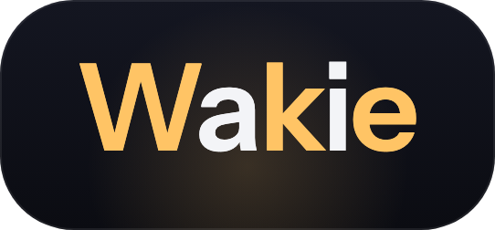

<div align="center">



<br>

**AI 구독 너무 많이 결제한 사람들을 위한 로컬 사용량 트래커.**
자는 동안 5시간 리셋 윈도우를 대신 굴려주는 봇은 덤.

<br>

[🇺🇸 English](README.md) &nbsp;·&nbsp; 🇰🇷 한국어

<br>

[](https://your-website.com)
[](LICENSE)


</div>

<br>

## 🎥 데모

<!-- Video Demo Placeholder -->

<div align="center">
<em>(내 나레이션이 덜 부끄러워지면 데모 영상 넣을 자리)</em>
</div>

<br>

## 📖 왜 만들었냐면

Claude Code는 사용량 제한이 있다. 근데 하루 단위가 아니라 **5시간짜리 롤링 윈도우**다. 첫 메시지를 보내는 순간 타이머가 돌기 시작해서 5시간 뒤에 리셋된다. 별거 아닌 것 같지? 하루 종일 이걸로 먹고살기 시작하면 얘기가 달라진다.

함정은 이거다. 오전 10시에 각 잡고 앉아서 일을 시작한다 치자. 첫 메시지가 윈도우를 10시에 박아버리니까 리셋은 오후 3시. 하필 오후 작업 한복판이다. 2시 40분쯤 뭔가 한창 풀고 있는데 한도 딱 걸리고, 그때부터는 그냥... 기다린다. 타이머 쳐다보면서. 잡고 있던 생각의 흐름이 리셋 기다리는 사이에 증발한다.

그래서 꼼수를 쓰기 시작했다. 아침에 일어나서 커피 마시기도 전에 터미널에 `good morning`을 친다. 버리는 메시지 한 방. 이러면 윈도우가 10시가 아니라 7시에 박히니까, 정작 일 시작할 땐 이미 리셋돼서 멀쩡하고, 리셋 타이밍도 작업 사이 빈 시간대로 떨어진다. 잘만 맞추면 윈도우를 이어 붙여서 타이머 기다리는 호구 신세를 안 져도 된다. Reddit에서 이런 거 극한으로 짜내는 사람들은 뭔가 있어 보이는 용어로 부르던데, 나는 그냥 세션 깨운다고 했다.

문제는, 매일 아침 6시 45분에 로봇한테 "굿모닝" 쳐주는 이 멍청한 수작업이야말로 내가 프로그래밍 배운 이유(= 이런 거 안 하려고)랑 정면으로 배치된다는 거다. 그래서 대신 쳐주는 봇을 짰다. 정해진 시간에 맥을 잠에서 깨우고, 인사하고, 윈도우 리셋시키고, 다시 재운다. 이름이 여기서 나왔다. Wakie.

그러다 좀 걷잡을 수 없이 커졌다. Claude, Codex, Antigravity를 동시에 굴리고 있는데 — 다 합치면 한 달에 $200이 넘는다 — 정작 각각을 내가 얼마나 태우고 있는지 감이 전혀 없더라. 대시보드도 없고. 그냥 느낌으로 쓰다가 제일 결정적인 순간에 "한도 초과" 싸대기 한 대 맞는 게 전부였다. 그래서 깨우기 봇에다 사용량 추적을 붙였다. 그다음 리셋 타이머. 그다음 메뉴바에 숫자 하나 띄워서 더는 추측 안 하게 만들었다. 그렇게 지금 이 꼴이 됐다.

그게 다다. 로드맵 발표자료 없고, 거창한 미션 선언문 없고, "개발자 생산성의 재정의" 같은 것도 없다. 그냥 빡쳤고, 주말이 있었고, 그래서 이게 생겼다.

<br>

## 🔒 데이터는 니 맥을 절대 안 떠난다

솔직히 말할게. 내가 안 만들었으면 나도 이 앱 안 깐다.

얘가 뭘 하는지 봐라. 니 로컬 AI 로그를 읽는다 — 프롬프트 횟수, 리셋 타임스탬프, 어떤 계정으로 로그인돼 있는지. 이건 딱 수상한 클로즈드 소스 메뉴바 앱이 몰래 쓸어담아서 어디 분석 서버로 쏴버릴 법한 종류의 데이터다. 정체불명 바이너리가 이거 하겠다고 하면 당연히 거절할 거고, 그게 맞다.

그래서 이렇게 만들었다. Wakie는 백엔드가 없다. 서버 자체가 없다. 텔레메트리 없고, 애널리틱스 없고, "익명 사용 통계" 이딴 것도 없고, 서명된 업데이트 확인 말고는 밖으로 나가는 게 아무것도 없다. 니 디스크에 있는 파일 읽어서, 니 컴퓨터에서 계산하고, 메뉴바에 숫자 하나 그린다. 이게 전부다. 와이파이 꺼도 똑같이 돌아간다.

그리고 내 말을 믿을 필요도 없다 — 그러라고 AGPL로 오픈소스 한 거니까. 코드가 다 저기 있다. repo에서 URL을 `grep` 해봐라. 업데이트 피드 하나 나오고 끝이다. 혹시라도 얘가 열면 안 되는 소켓을 여는 걸 잡으면, 내 이름 걸고 이슈 열어라.

<br>

## 지원하는 AI 툴

| 툴 | Wakie가 읽는 곳 | 상태 |
|----|----------------|------|
| **Claude Code** | 로컬 `/usage` 패널 + 세션 로그 | ✅ 동작 |
| **Codex** | `codex app-server` JSON-RPC (스크래핑 없이 구조화된 데이터) | ✅ 동작 |
| **Antigravity** | 네이티브 pty로 TUI 스크랩 (아직 구조화된 출구가 없어서) | ✅ 동작 |

각 툴은 [`packages/core/lib/src/adapters`](packages/core/lib/src/adapters) 안에 독립된 어댑터로 들어있다. 목록에 없는 툴 쓰면 저 폴더가 추가할 자리다 — 제일 비슷한 거 하나 복붙해서 손보면 된다. 보기보다 안 무섭다.

<br>

## 기술 스택

- **Flutter + Dart** — 앱이랑 추적 엔진 전체 (`packages/core`)
- **Swift** — 네이티브 macOS 부분: 메뉴바 트레이, 윈도우 처리, 예약된 절전-깨우기
- **Sparkle** — 서명된 자동 업데이트. DMG 평생 다시 받는 짓 안 해도 됨
- **Next.js 16 · React 19 · Tailwind v4 · TypeScript** — `apps/web`에 있는 랜딩 사이트
- **Developer ID 서명 + Apple 공증**된 DMG로 배포해서 Gatekeeper가 안 물고 늘어진다

<br>

## 설치

**빠른 방법 (curl):**

```bash
curl -fsSL https://raw.githubusercontent.com/JinLeeGG/Wakie/main/deploy/install.sh | bash
```

그래, `curl | bash` 인 거 안다. 이거 보고 움찔했으면 — 좋은 감이다. [스크립트 먼저 읽어봐라](deploy/install.sh). 30줄쯤 되고, 하는 일은 공증된 DMG 받아서 앱을 `/Applications`에 넣는 게 전부다.

**의심 많은 방법:** [Releases](https://github.com/JinLeeGG/Wakie/releases)에서 DMG 받아서 열고, Wakie를 Applications로 드래그. 서명·공증 돼있어서 우클릭-열기 삽질 안 해도 된다.

**소스에서 빌드:**

```bash
git clone https://github.com/JinLeeGG/Wakie.git
cd Wakie/apps/mac
flutter pub get
flutter run -d macos
```

Flutter (Dart SDK 3.12+)랑 Xcode 필요하다. 아직은 macOS 전용.

<br>

## 기여

PR 진심으로 환영한다. 특히 이런 거 도와주면 좋다:

- **다른 AI 툴 어댑터** — 패턴은 [`packages/core/lib/src/adapters`](packages/core/lib/src/adapters)에 있다. 하나 복사해서 연결하고 보내라.
- **재현 스텝 있는 버그 리포트.** "안 돼요"는 날 슬프게 하고, "이렇게 했더니 이렇게 됨"은 날 고치게 만든다.
- **맨날 시작한다고 하고 안 하는 Windows/Linux 포팅.**

CLA 없고, 봇 관문 없고, 12칸짜리 이슈 템플릿 없다. 이슈 열고, PR 보내고, 사람답게 얘기해서 풀면 된다.

<br>

---

<div align="center">

**라이선스:** [AGPL-3.0](LICENSE) — 포크하고, 위에 쌓아 올리고, 열려있게만 유지해라.
Copyright © 2026 Gyujin Lee.

로봇한테 아침 6시에 "굿모닝" 치는 게 지겨워져서 만듦.

</div>
