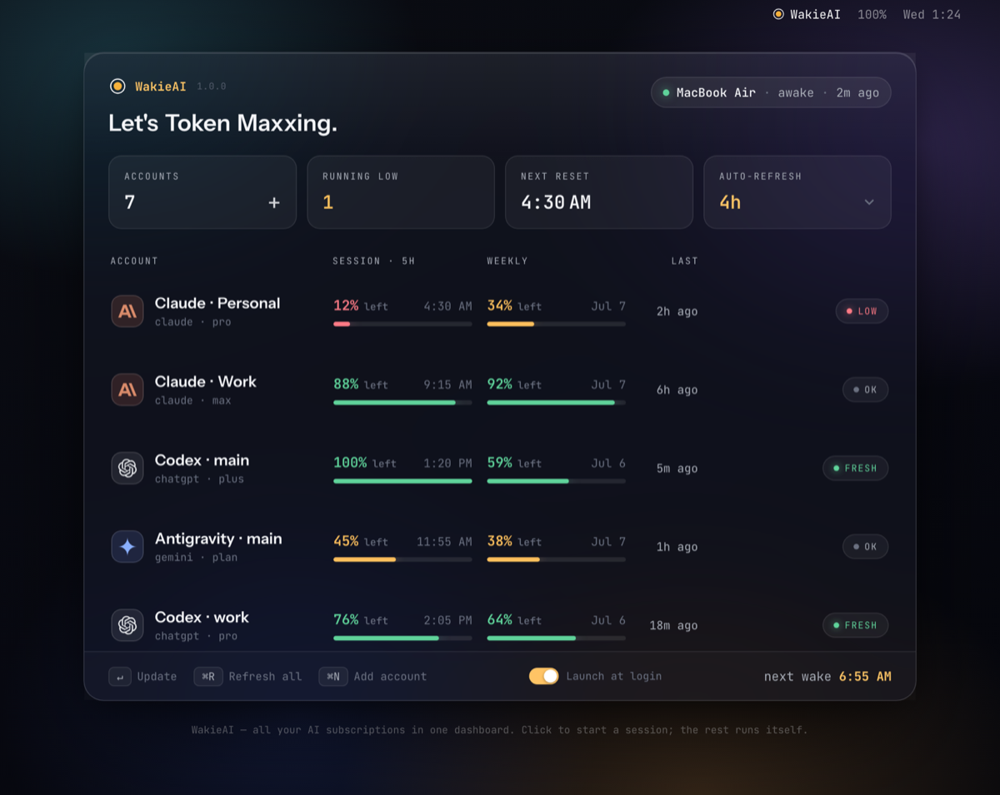
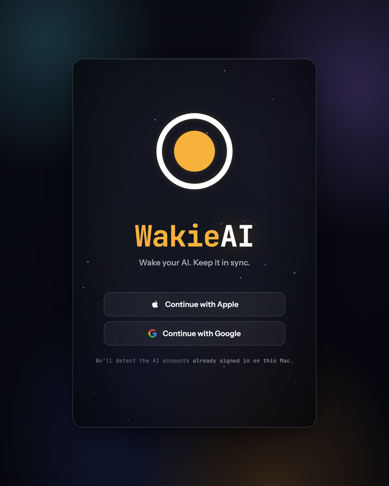
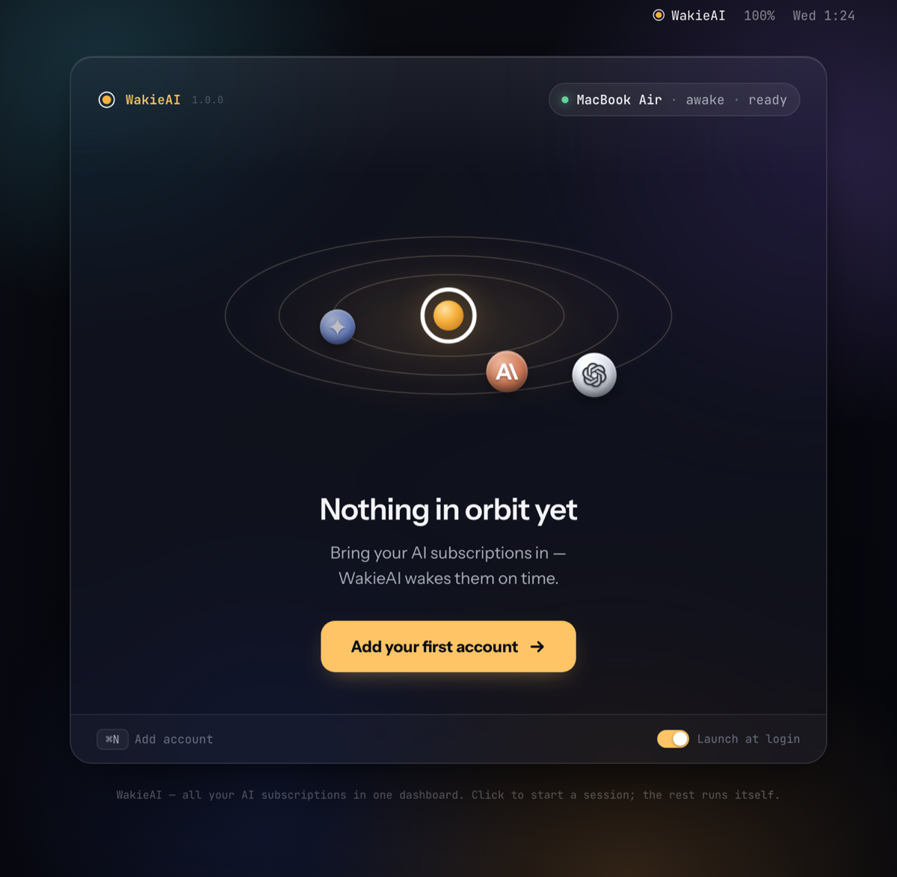
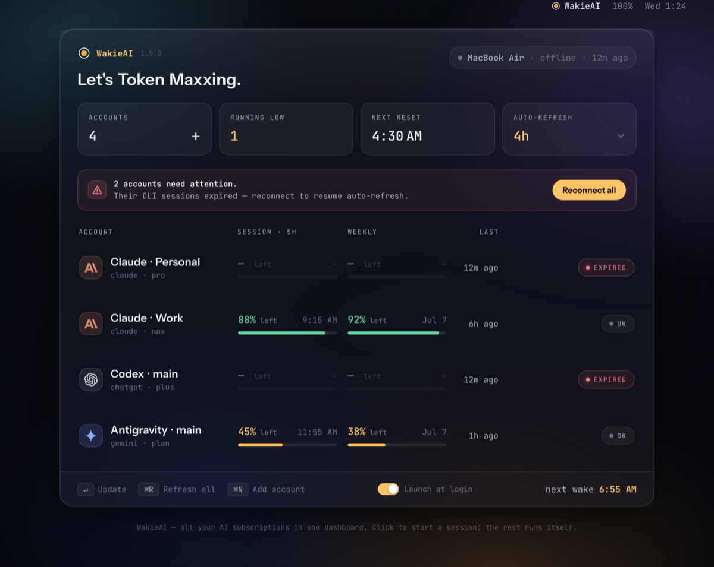
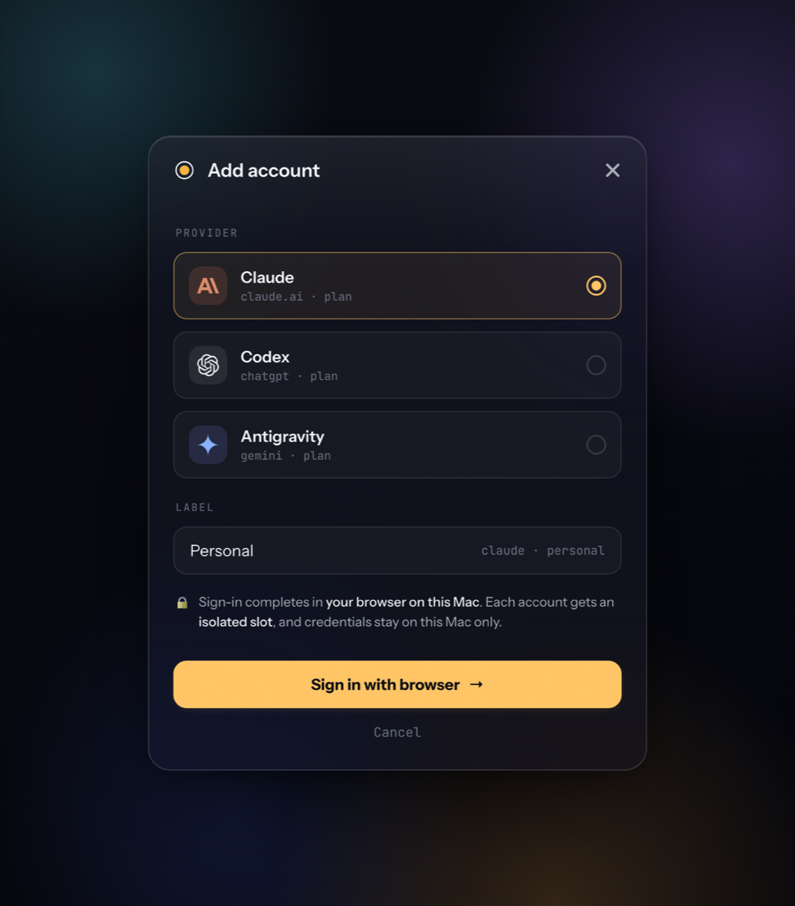
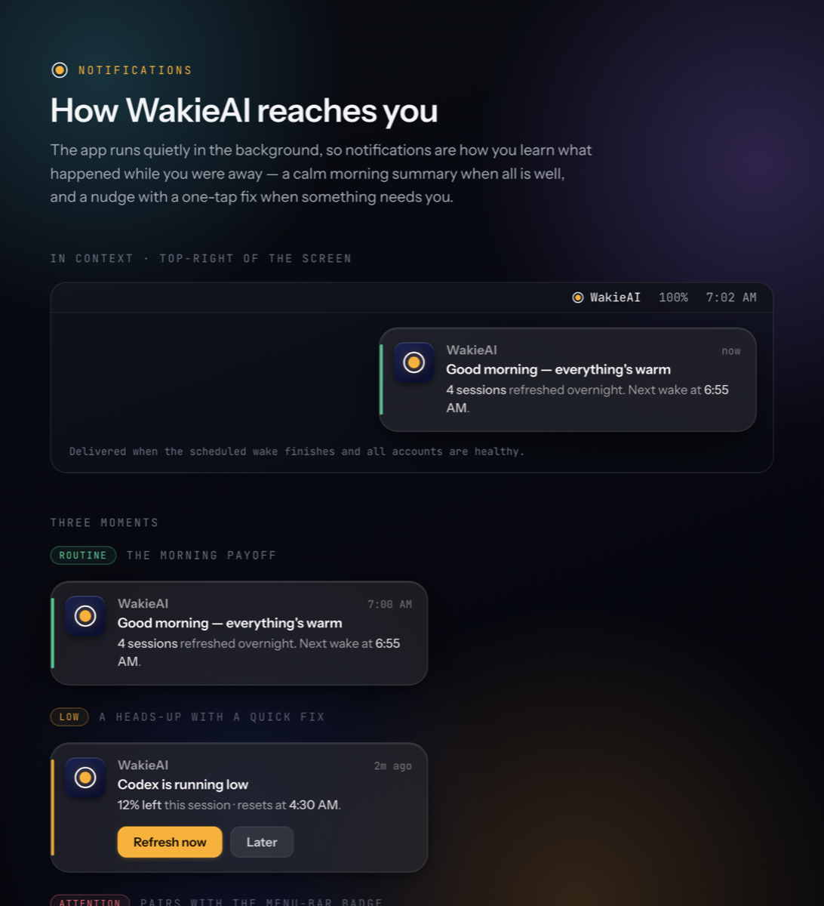
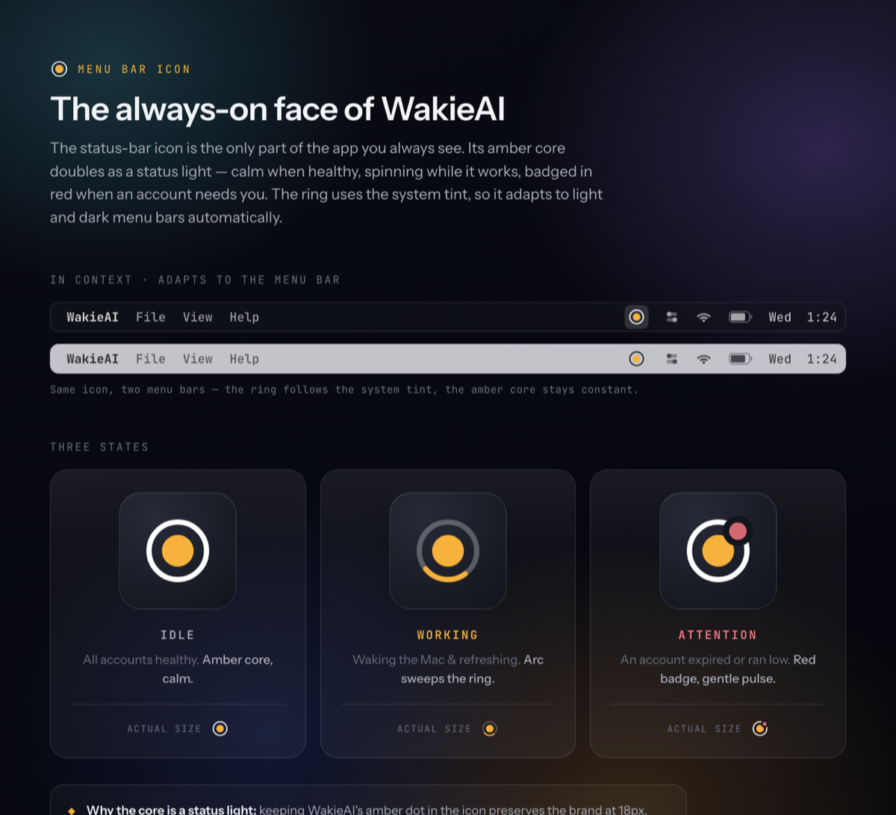

<div align="center">


# WakieAI

### One tier's price. Every subscription, at full usage.

A macOS menu-bar app that keeps your logged-in AI subscriptions **warm, tracked, and ready** — one dashboard for every account's usage and reset windows, and a Mac that wakes itself on schedule to refresh sessions while you sleep.

<br>


<br>



</div>

<br>

> [!NOTE]
> **Project status — Phase 1 (automation) in hand.** On top of the Phase 0 core (auto-detect · live `/usage` for Claude · Codex · Antigravity · dashboard · on-demand session start), the app now schedules a dark wake from sleep to refresh sessions, sends the morning summary, and handles add-account sign-in. It ships as a **Developer ID–signed, notarized DMG** (the Mac App Store is off the table — App Sandbox forbids the engine's core ops; see PRD §16). Next up is Phase 2 (remote — see [Roadmap](#roadmap)). The [product spec](docs/PRD.md) and click-through [UI prototype](docs/design/) remain the source of truth for the design.

<br>

## Contents

- [Overview](#overview) · [Screens](#screens) · [Features](#features) · [How it works](#how-it-works)
- [Supported providers](#supported-providers) · [Roadmap](#roadmap) · [Getting started](#getting-started)
- [Privacy & security](#privacy--security) · [FAQ](#faq) · [Non-goals](#non-goals) · [Repository](#repository)

<br>

## Overview

Power users get more out of AI by running **several cheaper subscriptions** instead of one $200 top tier. The catch is that juggling them is tedious — which account still has budget, when each rolling window resets, and when to switch. You end up opening every CLI or web app just to check.

**WakieAI is a multi-account AI usage orchestrator.** A background app on your Mac cycles through your logged-in AI CLIs (Claude, Codex, Antigravity), reads each account's session and weekly usage, and lays it out in one dashboard. It wakes the machine from sleep on a schedule to keep sessions fresh, and nudges you the moment an account runs low or needs a reconnect — each nudge with a one-tap fix.

The result: **one tier's price, every subscription at full usage** — without babysitting any of them.

<br>

## Screens

<table>
  <tr>
    <td width="50%" align="center"><br><sub><b>Onboarding</b> — sign in, auto-detect accounts</sub></td>
    <td width="50%" align="center"><br><sub><b>Empty state</b> — nothing in orbit yet</sub></td>
  </tr>
  <tr>
    <td width="50%" align="center"><br><sub><b>Needs attention</b> — expired / offline states</sub></td>
    <td width="50%" align="center"><br><sub><b>Add account</b> — per-provider, isolated slot</sub></td>
  </tr>
  <tr>
    <td width="50%" align="center"><br><sub><b>Notifications</b> — morning summary + one-tap fixes</sub></td>
    <td width="50%" align="center"><br><sub><b>Menu-bar icon</b> — idle / working / attention</sub></td>
  </tr>
</table>

> Every screen is a live mockup in [`docs/design/`](docs/design/) — open any `.html` in a browser. The onboarding → dashboard flow is wired end-to-end and clickable.

<br>

## Features

- 🛰️ **Unified dashboard** — session % + weekly % and reset times for every account, with live status pills.
- ⏰ **Warm on schedule** — the Mac wakes from sleep (`pmset` + a LaunchAgent helper) to start/refresh sessions, then sleeps again.
- 🔔 **Right-account nudges** — "running low", "just reset", "reconnect needed" — each notification ships a one-tap action.
- ⚡ **Per-account actions** — **Update** (start a session + refresh that account) and global **Refresh all** (read status only).
- 👥 **Multi-account by design** — many accounts per provider, isolated via each CLI's config home (`CLAUDE_CONFIG_DIR`, `CODEX_HOME`, `HOME`).
- 🔒 **Local-first** — credentials, prompts, and responses never leave your Mac.

<br>

## How it works

```
Phase 0–1   ┌─────────────────────────┐   cycles local CLIs    ┌──────────────────────────────┐
            │   Mac menu-bar app       │ ─────────────────────▶ │ claude / codex / agy accounts │
            │   engine + dashboard     │                        │ credentials · prompts = local │
            └─────────────────────────┘                        └──────────────────────────────┘

Phase 2     ┌──────────────┐   Supabase relay (commands +   ┌──────────────┐
            │  iPhone app  │ ◀────  status metadata only) ──▶ │   Mac app    │
            └──────────────┘                                  └──────────────┘
```

The Mac app is both the **engine** — detect → wake → read usage → start session → notify — and the **dashboard**. Reading status is always quota-free (each provider exposes usage without spending it — see [How usage is read](#how-usage-is-read-per-provider)); only *starting* a session consumes a little, so it uses the cheapest model.

In **Phase 2**, a phone becomes a remote control over a Supabase relay that carries only commands (a fixed enum) and status metadata — never credentials or content.

<br>

### How usage is read (per provider)

There's no single API for "how much subscription is left" — each provider exposes it differently, so every adapter uses its own **read path**. All of them obey the same rule (**R0**): read-only, official binary, tokens never extracted, prompt/response content never stored.

| Provider | Read path | Why this way | Typical latency |
| --- | --- | --- | --- |
| **Codex** (`codex`) | **Structured JSON-RPC.** `codex app-server` (stdio) answers `account/rateLimits/read` after an `initialize` handshake — usage returns as JSON, with absolute epoch reset times. No scraping. | Codex ships a machine-readable surface, so we use it directly. | ~0.7 s |
| **Claude** (`claude`) | **TUI scrape.** Drive the interactive `claude` TUI in a pty, open `/usage`, render the terminal bytes through a tiny built-in VT emulator, then parse the panel text. | Claude has no structured usage endpoint; the only non-scrape path would extract the session token, which R0 forbids. | ~5 s |
| **Antigravity** (`agy`) | **Native-pty TUI scrape.** Same idea as Claude, but `agy` won't render unless attached to a *real, sized* terminal, so the pty is allocated via FFI (`openpty` + `posix_spawnp`, 40×120). Its two model groups (Gemini / Claude·GPT) × two windows collapse to the **most-constrained** group per window, so the meter never overstates headroom. | No structured surface at all — `agy`'s `/usage` lives only inside the interactive TUI. | ~2–3 s |

Each read path is split into a **pure parser** (screen-text or JSON → status), golden-tested against captured fixtures, and a thin, injectable **live seam** (the pty/process/RPC glue). Parsers are deterministic and unit-tested; the fragile I/O seam is swapped for fixtures in tests. Adapters live in [`packages/core/lib/src/adapters/`](packages/core/lib/src/adapters/).

<br>

## Supported providers

| Provider (CLI) | Start session | Usage / reset | Multi-account | Auth |
| --- | --- | --- | --- | --- |
| **Claude** (`claude`) | `-p` | `/usage` + `/stats` | `CLAUDE_CONFIG_DIR` | claude.ai |
| **Codex** (`codex`) | `exec` | `app-server` RPC | `CODEX_HOME` / `--profile` | ChatGPT |
| **Antigravity** (`agy`) | `-p` | `/usage` (weekly · 5h) | `HOME` sandbox | Google |

> **Grok** is intentionally out of scope — a shared weekly pool with no 5-hour window, and usage isn't exposed via its CLI, so it doesn't fit the product's core.

<br>

## Roadmap

- [x] **Phase 0 — Mac core.** Auto-detect accounts · scrape `/usage` · menu-bar dashboard · on-demand session start.
- [x] **Phase 1 — Automation.** Sleep-wake (`pmset` + LaunchAgent dark wake) · schedules · macOS notifications · add-account UX · Developer ID–signed, notarized DMG.
- [ ] **Phase 2 — Remote.** Supabase relay + iPhone app (remote dashboard/control) + push notifications.
- [ ] **Phase 3 — Hardening.** Multi-account scale · auto-login guidance · Windows/Android exploration.
- [x] **Phase −1 — Spec & design.** [PRD](docs/PRD.md) + full click-through UI prototype.

<br>

## Getting started

> [!IMPORTANT]
> Phase 0 (the Mac core) runs today. You can launch the menu-bar app locally, or explore the **interactive prototype** for the full designed flow.

**Run the Mac app (Phase 0)**

```bash
git clone https://github.com/JohnLee/WakeyAI.git
cd WakeyAI/apps/mac
flutter run -d macos          # menu-bar app: auto-detects logged-in CLIs, reads live /usage
```

Any provider CLI you're already logged into (`claude`, `codex`, `agy`) is detected automatically — no re-login, no API keys. The dashboard shows live session/weekly usage and lets you start a session per account.

**Explore the prototype**

```bash
open docs/design/onboarding-step1.html   # start of the wired flow → dashboard
```

Or open any single screen in [`docs/design/`](docs/design/) directly in a browser.

**Planned repo layout**

```
packages/core     # Dart — account models, provider adapters, status logic
apps/mac          # Flutter macOS menu-bar app + LaunchAgent helper
apps/phone        # Flutter iOS/Android remote (Phase 2)
```

<br>

## Privacy & security

- **Local-only by default.** CLI OAuth tokens and all prompt/response content stay on your Mac, in each CLI's own config home and the macOS keychain.
- **No credential proxy.** WakieAI drives each provider's *official* login — it never sees or forwards your passwords.
- **No content leaves the device.** Prompts and responses are never stored or transmitted.
- **Phase-2 relay is metadata-only.** It carries usage numbers, pairing info, and a **fixed command enum** (no arbitrary execution) — protected by row-level security and TLS. The blast radius of a compromised relay is limited to {start session · wake · read status}.

<br>

## FAQ

<details>
<summary><b>Does WakieAI reset or extend my quota?</b></summary><br>
No. It <i>starts</i> the rolling usage window and reads how much is left — usage is still consumed normally. It never resets, extends, or bypasses limits.
</details>

<details>
<summary><b>Does it need my passwords or API keys?</b></summary><br>
No. It rides on each CLI's existing subscription login. There are no API keys and no credentials to hand over.
</details>

<details>
<summary><b>Is this against provider Terms of Service?</b></summary><br>
WakieAI runs each provider's official CLI on your own machine, under your own login — it is not a proxy or a shared service. Automated, periodic prompting fitting each provider's ToS is an explicit assumption we monitor; adapters can be paused if a provider's terms change.
</details>

<details>
<summary><b>Does my Mac have to stay on?</b></summary><br>
No — it schedules a wake from sleep to do its work, then sleeps again. It needs to be plugged in and in a logged-in sleep state (keychain unlocked, the macOS default).
</details>

<details>
<summary><b>Do I need the phone app?</b></summary><br>
No. The Mac app is fully standalone (Phase 0–1). The iPhone app (Phase 2) is an optional remote control and doesn't work without the Mac.
</details>

<br>

## Non-goals

- ❌ Resetting or bypassing quotas — it only *starts* the window.
- ❌ Proxying credentials or making calls on your behalf.
- ❌ Storing or transmitting prompt/response content.
- ❌ Teams / org / SSO, Grok, and provider API-key tracks (for now).

<br>

## Repository

```
WakeyAI/
├── CLAUDE.md              # engineering behavior guidelines
├── docs/
│   ├── PRD.md             # product requirements — source of truth
│   └── design/            # interactive UI mockups, logo, app icon, screenshots
└── README.md
```

<br>

---

<div align="center">
<sub>Built by John · <a href="mailto:korus.exe@gmail.com">korus.exe@gmail.com</a> · Full detail in the <a href="docs/PRD.md">PRD</a></sub>
<br>
<sub>© 2026 · All rights reserved · License TBD</sub>
</div>
